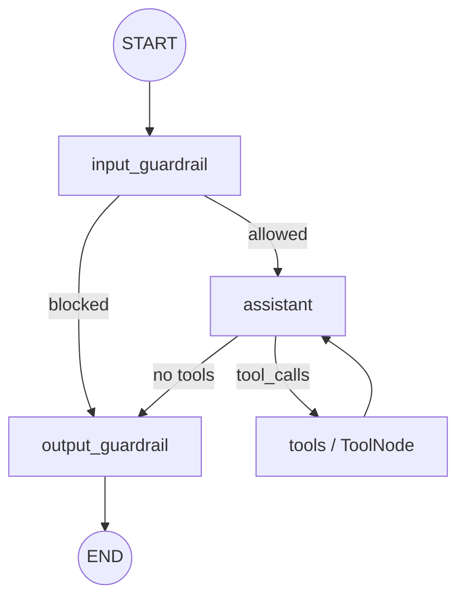

# Technical Documentation

> Internal architecture, data flow, and component design of the **LangGraph Notepad RAG Agent** (v0.4.0).

---

## Table of Contents

1. [System Overview](#system-overview)
2. [Architecture Diagram](#architecture-diagram)
3. [Component Deep-Dive](#component-deep-dive)
   - [Agent Core](#agent-core)
   - [Responsible AI Layer](#responsible-ai-layer)
   - [Storage Layer](#storage-layer)
   - [Server Layer](#server-layer)
   - [Configuration](#configuration)
4. [Data Flow](#data-flow)
5. [State Graph Execution](#state-graph-execution)
6. [Prompt Library & Persona System](#prompt-library--persona-system)
7. [Security Model](#security-model)
8. [Error Handling](#error-handling)
9. [Testing Architecture](#testing-architecture)
10. [Deployment Model](#deployment-model)

---

## System Overview

This project is a conversational AI agent built on [LangGraph](https://github.com/langchain-ai/langgraph) that provides:

- **Multi-turn conversation** with memory (session-scoped and persistent via notepad)
- **Web search** (DuckDuckGo)
- **File upload & ingestion** via [Microsoft MarkItDown](https://github.com/microsoft/markitdown) with chunked vector store persistence
- **RAG over stored notes** (Jaccard similarity, ChromaDB embeddings, or SQL)
- **Responsible AI guardrails** applied at graph edges (input/output)
- **Three exposure surfaces**: Interactive CLI, FastAPI HTTP service, and MCP server (SSE)

The agent uses a **tool-calling loop** — the LLM decides when to invoke tools (search, save, retrieve) and integrates their results into its response.

---

## Architecture Diagram

```
┌─────────────────────────────────────────────────────────────────────────┐
│                            Entry Points                                  │
├──────────────┬──────────────────────────┬───────────────────────────────┤
│  CLI (cli.py) │  FastAPI (server/api.py)  │  MCP Server (server/mcp.py) │
└──────┬───────┴────────────┬─────────────┴────────────────┬──────────────┘
       │                    │                               │
       ▼                    ▼                               ▼
┌──────────────────────────────────────────────────────────────────────────┐
│                        AgentSession (agent/session.py)                    │
│  - Manages conversation history                                          │
│  - Owns store, graph, settings                                           │
│  - Exposes .chat(message) → response                                     │
└────────────────────────────────┬─────────────────────────────────────────┘
                                 │
                                 ▼
┌──────────────────────────────────────────────────────────────────────────┐
│                    LangGraph State Machine (agent/graph.py)               │
│                                                                          │
│   START → input_guardrail ──┬── (blocked) ──→ output_guardrail → END    │
│                             │                                            │
│                             └── (allowed) ──→ assistant ─┬── (tools) ──→ │
│                                                          │   ToolNode    │
│                                                          │       │       │
│                                                          │  ◄────┘       │
│                                                          │               │
│                                                          └── (END) ──→   │
│                                                          output_guardrail│
│                                                                → END     │
└───────────────────────────┬──────────────────────────────────────────────┘
                            │
            ┌───────────────┼────────────────────┐
            ▼               ▼                    ▼
    ┌──────────────┐ ┌─────────────┐  ┌───────────────────┐
    │  LLM Factory │ │    Tools    │  │  Responsible AI    │
    │ (agent/llm)  │ │(agent/tools)│  │(responsible_ai/)   │
    │              │ │             │  │                    │
    │ - OpenAI     │ │ - search_web│  │ - ContentFilter    │
    │ - HuggingFace│ │ - save_note │  │ - PIIDetector      │
    │   (GGUF)     │ │ - retrieve  │  │ - BiasEvaluator    │
    └──────────────┘ └──────┬──────┘  │ - RateLimiter      │
                            │         │ - AuditLogger      │
                            ▼         └───────────────────┘
               ┌────────────────────────┐
               │  Storage Layer (store/) │
               │                        │
               │ - FileNoteStore (txt)   │
               │ - ChromaNoteStore (vec) │
               │ - SqlNoteStore (sqlite) │
               └────────────────────────┘
```

---

## Component Deep-Dive

### Agent Core

Located in `src/agent/`. This is the brain of the system.

#### `graph.py` — State Machine

The central execution engine is a **LangGraph `StateGraph`** with the following nodes:

| Node | Purpose |
|------|---------|
| `input_guardrail` | Runs RAI checks on user input (content filter, PII redaction, rate limiting) |
| `assistant` | Invokes the LLM with system prompt + conversation history |
| `tools` | Executes tool calls made by the LLM (via `ToolNode`) |
| `output_guardrail` | Runs RAI checks on LLM output (redaction, disclaimers, bias detection) |

**State schema** (`AgentState`):
```python
class AgentState(TypedDict):
    messages: Annotated[list[AnyMessage], add_messages]
    session_id: str
```

The `add_messages` annotation tells LangGraph to **append** new messages rather than replace.

**Edge logic:**
- After `input_guardrail`: if the last message is an `AIMessage` (i.e., a blocked response was injected), route to `output_guardrail` directly. Otherwise, route to `assistant`.
- After `assistant`: if the LLM response has `tool_calls`, route to `tools`. Otherwise, route to `output_guardrail`.
- After `tools`: always route back to `assistant` (for the LLM to interpret tool results).
- After `output_guardrail`: always `END`.

#### `llm.py` — LLM Factory

Creates a LangChain-compatible `BaseChatModel` based on configuration:

| Provider | Implementation | Notes |
|----------|---------------|-------|
| `openai` | `ChatOpenAI` | Supports native tool binding via `bind_tools()` |
| `huggingface` | `ChatLlamaCpp` | Downloads GGUF from HuggingFace Hub, runs locally |

The factory pattern allows swapping models without changing any other code.

#### `tools.py` — Tool Definitions

Tools are LangChain `@tool`-decorated functions created by `create_tools(store, settings)`:

| Tool | Input | Output | Side Effects |
|------|-------|--------|-------------|
| `search_web` | `query: str` | Search results string | None |
| `save_note` | `note: str` | Confirmation string | Writes to NoteStore |
| `retrieve_notes` | `question: str` | Formatted relevant notes | None |
| `ingest_file` | `file_path: str` | File content as Markdown | None |

Tools are **closed over** the `store` and `settings` instances at creation time.

#### `file_ingest.py` — File Ingestion Pipeline

Converts uploaded files to Markdown using [Microsoft MarkItDown](https://github.com/microsoft/markitdown) and chunks them for vector store persistence.

**Pipeline:**
```
File (bytes or path)
  │
  ├─ Validate extension (allowlist) + file size (<50 MB)
  │
  ├─ MarkItDown.convert() → raw Markdown
  │
  ├─ chunk_text() → overlapping chunks (paragraph-aware)
  │
  └─ store.append() per chunk (tagged with filename + chunk index)
```

**Key functions:**

| Function | Purpose |
|----------|--------|
| `convert_file_to_markdown(path)` | Single file → Markdown string |
| `convert_bytes_to_markdown(bytes, name)` | Bytes → temp file → Markdown |
| `chunk_text(text, size, overlap)` | Paragraph-aware text chunking |
| `ingest_file_to_store(path, store)` | Full pipeline: convert + chunk + persist |
| `ingest_bytes_to_store(bytes, name, store)` | Same but from raw bytes |

**Security:** Only files with extensions in `ALLOWED_EXTENSIONS` are processed. Files are validated before conversion to prevent arbitrary file processing.

#### `session.py` — Session Orchestrator

`AgentSession` is the primary public interface:

```python
session = AgentSession(settings=settings, persona="research_assistant")
response = session.chat("What is quantum computing?")
```

Responsibilities:
1. Creates the store, tools, and compiled graph
2. Maintains `_history: list[AnyMessage]` for multi-turn context
3. Invokes the graph with full history on each `.chat()` call
4. Persists both user and assistant messages to the store for long-term RAG memory
5. Provides `.ingest_file(path)` and `.ingest_file_bytes(bytes, name)` for file upload with vector store persistence

#### `prompts.py` — Prompt Library

A registry of `Persona` dataclass instances. Each persona defines:

| Field | Role |
|-------|------|
| `duty` | What the agent must do |
| `responsibility` | Ethical/operational boundaries |
| `tone` | Communication style |
| `tool_instructions` | How to use tools |
| `domain_knowledge` | Domain-specific context |
| `custom_rules` | Additional behavioral rules |

The `system_prompt` property assembles all fields into a structured system message with a mandatory **Responsible AI Principles** footer.

---

### Responsible AI Layer

Located in `src/responsible_ai/`. This layer wraps every message through configurable safety checks.

#### Pipeline (executed in order)

```
Input → Rate Limiter → Content Filter → PII Detector → (pass to LLM)
Output → Content Filter → PII Redactor → Bias Evaluator → Disclaimer Injection → (return to user)
```

#### Components

| Component | File | Purpose |
|-----------|------|---------|
| `Guardrails` | `guardrails.py` | Orchestrator — wires all checks together |
| `ContentFilter` | `content_filter.py` | Regex-based detection of harmful content (violence, self-harm, hate, sexual, illegal) with Unicode normalization, leetspeak reversal, and jailbreak pattern detection (DAN, roleplay, delimiter injection, etc.) |
| `PIIDetector` | `pii_detector.py` | Regex patterns for email, phone, SSN, credit cards, IP addresses — redacts with `[REDACTED]` |
| `BiasEvaluator` | `bias_evaluator.py` | Keyword-based bias/stereotype detection across race, gender, religion, age, etc. |
| `NemoContentRail` | `nemo_rails.py` | NeMo Guardrails LLM-as-judge safety checks using Colang self-check input/output flows |
| `FairnessEvaluator` | `fairness.py` | Fairlearn-powered statistical fairness metrics (demographic parity via MetricFrame, selection rate analysis) |
| `TestSetValidator` | `testset_validator.py` | Embedding-based coherence validation of (prompt, output, reference) triples before bias/fairness evaluation. Uses cosine similarity with configurable threshold (default 0.4) and max invalid ratio (default 20%) |
| `AuditLogger` | `transparency.py` | Privacy-preserving JSONL audit trail (local file or Azure Blob) with configurable retention |
| `RAIConfig` | `config.py` | Immutable dataclass with toggles for every feature; factory `rai_config_from_env()` for env var configuration |

#### Disclaimer Injection

When the LLM output discusses medical, legal, or financial topics (detected by keyword matching), a disclaimer is automatically appended to the response.

#### Rate Limiting

Per-session sliding-window rate limiter with automatic cleanup of stale sessions (>1 hour inactive).

#### Test Set Validation (`testset_validator.py`)

Before running bias or fairness evaluation on a user-supplied dataset, `TestSetValidator` ensures the (prompt, output, reference) triples are semantically coherent:

```
┌───────────────────────────────────────────────────────────────┐
│   User provides: prompts[], outputs[], references[]           │
└──────────────────────────────┬────────────────────────────────┘
                               │
                               ▼
┌───────────────────────────────────────────────────────────────┐
│   Embed all three columns via sentence-transformers           │
│   (shared singleton model from src/core/embeddings.py)        │
└──────────────────────────────┬────────────────────────────────┘
                               │
                               ▼
┌───────────────────────────────────────────────────────────────┐
│   Per-row pairwise cosine similarity:                         │
│     • prompt ↔ output                                         │
│     • prompt ↔ reference                                      │
│     • output ↔ reference                                      │
└──────────────────────────────┬────────────────────────────────┘
                               │
                               ▼
┌───────────────────────────────────────────────────────────────┐
│   Flag rows where ANY pair < threshold (default 0.4)          │
│   Reject dataset if invalid_rows / total > max_ratio (20%)    │
└───────────────────────────────────────────────────────────────┘
```

Returns a `ValidationReport` with per-row scores, aggregate means, and a human-readable summary. The `filter_valid_rows()` convenience method returns only coherent rows for downstream evaluation.

---

### Storage Layer

Located in `src/store/`. Implements the `NoteStore` abstract base class:

```python
class NoteStore(ABC):
    def append(self, note: str) -> None: ...
    def load_notes(self) -> List[str]: ...
    def retrieve(self, query: str, k: int = 3, threshold: float = 0.1) -> List[RetrievedNote]: ...
    def clear(self) -> None: ...
```

#### Backends

| Backend | Class | Storage | Retrieval Method |
|---------|-------|---------|-----------------|
| `file` | `FileNoteStore` | Plain text file, one note per line | Jaccard similarity with stop-word filtering |
| `chroma` | `ChromaNoteStore` | ChromaDB vector database | Sentence-transformer embeddings + cosine similarity |
| `sqlite` | `SqlNoteStore` | SQLite via SQLAlchemy ORM | SQL `LIKE` matching (extensible to FTS5) |

The `create_note_store()` factory in `store/factory.py` instantiates the correct backend based on `STORE_BACKEND` env var.

#### Alembic Migrations

Schema changes to the SQLite backend are managed by Alembic (`alembic/` directory). The initial migration creates the `notes` table with columns: `id`, `text`, `created_at`.

---

### Server Layer

Located in `src/server/`. Exposes the agent over HTTP and MCP.

#### `api.py` — FastAPI HTTP Service

- **Lifespan**: Validates configuration on startup, clears sessions on shutdown
- **Session management**: In-memory `dict[str, AgentSession]` — sessions created on first request or by explicit `session_id`
- **Authentication**: Optional `X-API-Key` header validated via `secrets.compare_digest` (disabled when `API_KEY` env is empty)
- **Persona support**: `ChatRequest.persona` field + `GET /personas` endpoint

#### `mcp.py` — MCP Server (SSE Transport)

Implements the [Model Context Protocol](https://modelcontextprotocol.io/) over Server-Sent Events. MCP clients (Claude Desktop, VS Code Copilot) connect to `GET /mcp` for the SSE stream and send commands to `POST /mcp`.

Tools exposed via MCP use the same store and settings as the HTTP agent but run independently (no session state).

#### `registry.py` — Semantic Tool Registry

The `ToolRegistry` provides **semantic search over registered tools** using sentence-transformer embeddings. MCP clients can call `search_tools` to discover relevant tools by natural language query before invoking them.

---

### Configuration

Located in `src/config/`. Uses a layered resolution strategy:

```
Priority (highest wins):
  1. Keyword arguments to get_settings()
  2. Environment variables (+ .env file)
  3. config/config.json defaults
```

The `Settings` dataclass is frozen (immutable) after construction. It includes a `.validate()` method that raises `ConfigurationError` for invalid configurations (e.g., missing API key when using OpenAI).

---

## Data Flow

### Complete request lifecycle (HTTP API):

```
1. Client sends POST /chat {message, session_id?, persona?}
2. api.py validates API key (if configured)
3. api.py finds or creates AgentSession
4. session.chat(message) is called:
   a. HumanMessage added to session history
   b. Graph invoked with full history + session_id
   c. Graph execution:
      i.   input_guardrail: rate limit → content filter → PII redact
      ii.  (if blocked) → inject AIMessage with blocked_reason → skip to output
      iii. assistant: LLM called with [SystemMessage + history]
      iv.  (if tool_calls) → ToolNode executes tools → back to assistant
      v.   output_guardrail: content filter → PII redact → bias check → disclaimers
   d. Final AIMessage extracted from state
   e. Both user & assistant messages persisted to NoteStore (RAG memory)
5. api.py returns {response, session_id}
```

### RAG retrieval path:

```
1. LLM decides to call retrieve_notes(question="...")
2. ToolNode invokes the tool
3. NoteStore.retrieve(query, k=3) runs:
   - File: Jaccard similarity (|intersection| / |union| of word sets, with stop-words removed)
   - Chroma: sentence-transformer embedding → cosine similarity search
   - SQLite: SQL LIKE pattern matching
4. Top-k results (above threshold) returned to LLM as tool result
5. LLM incorporates retrieved notes into its response
```

### File upload lifecycle:

```
1. Client sends POST /chat/upload (multipart: file + optional message + session_id)
2. api.py validates file extension against ALLOWED_EXTENSIONS
3. File bytes read and converted to Markdown via MarkItDown
4. session.ingest_file_bytes(content, filename) called:
   a. convert_bytes_to_markdown() → temp file → MarkItDown.convert() → Markdown string
   b. chunk_text() splits into overlapping chunks (paragraph-aware, ~1000 chars each)
   c. Each chunk stored in NoteStore as "[File: name | Chunk N/M]\n{chunk_text}"
5. User prompt sent to session.chat() referencing the stored file
6. Agent uses retrieve_notes tool to access relevant chunks when answering
7. File content persists in store — available for all subsequent turns in the session
```

---

## State Graph Execution

The compiled LangGraph is a **cyclic graph** (the `assistant → tools → assistant` loop). Execution proceeds as:



Key properties:
- **Deterministic routing**: Edge conditions are pure functions of the state (no randomness)
- **Bounded loops**: The tool loop terminates when the LLM stops emitting `tool_calls` (typically 1–3 iterations)
- **Immutable state transitions**: Each node returns a new state dict; LangGraph handles merging via the `add_messages` reducer

---

## Prompt Library & Persona System

The persona system decouples **behavioral configuration** from code:

```
┌──────────────────────────────────────┐
│           Persona Registry            │
│                                      │
│  register_persona(Persona(...))      │
│  get_persona("name") → Persona      │
│  list_personas() → list[str]        │
└──────────────────────┬───────────────┘
                       │
                       ▼
┌──────────────────────────────────────┐
│       Persona.system_prompt          │
│                                      │
│  "You are {display_name}. {desc}"   │
│  "## Duty\n{duty}"                  │
│  "## Responsibility\n{resp}"        │
│  "## Tone\n{tone}"                  │
│  "## Tool Usage\n{tool_instr}"      │
│  "## Domain Knowledge\n{domain}"    │
│  "## Rules\n- {rule1}\n- {rule2}"   │
│  "## Responsible AI Principles\n…"  │
└──────────────────────────────────────┘
```

Persona selection flows from entry point → `AgentSession` → `build_graph()` → `call_model()` node (injected as `SystemMessage`).

---

## Security Model

| Layer | Mechanism |
|-------|-----------|
| **API Authentication** | Optional `X-API-Key` header; constant-time comparison via `secrets.compare_digest` |
| **Input Validation** | Pydantic models with `min_length`/`max_length` constraints on `ChatRequest.message` || **File Upload Validation** | Extension allowlist + file size cap (50 MB default); prevents arbitrary file processing || **Content Filtering** | Regex patterns block harmful prompts before they reach the LLM |
| **PII Protection** | Automatic detection and `[REDACTED]` replacement of emails, phones, SSN, credit cards, IPs |
| **Rate Limiting** | Per-session sliding window prevents abuse |
| **Audit Trail** | Every interaction logged with metadata (no raw content by default) |
| **Docker** | Non-root user, multi-stage build (no build tools in runtime image) |
| **CI/CD** | `pip-audit` for dependency vulnerabilities, `bandit` for static security analysis |
| **Secrets** | API keys never logged (`repr=False` on settings fields) |

---

## Error Handling

A structured exception hierarchy in `src/core/exceptions.py`:

```
AgentError (base)
├── ConfigurationError    — invalid/missing config
├── NotepadError          — store failures
│   └── NotepadFullError  — file size exceeded
├── RetrievalError        — RAG lookup failure
├── ToolExecutionError    — tool runtime error
└── LLMError              — API/model failure
```

The API layer catches `AgentError` subtypes and maps them to appropriate HTTP status codes (400, 500, 503).

---

## Testing Architecture

Tests live in `tests/` and use `pytest`:

| Test File | Coverage |
|-----------|----------|
| `test_api.py` | FastAPI endpoints (uses `httpx` async client) |
| `test_config.py` | Settings loading, validation, env var override |
| `test_file_ingest.py` | File conversion, chunking, store ingestion, validation |
| `test_mcp_registry.py` | MCP tool registry and semantic search |
| `test_notepad_rag.py` | Note storage, retrieval, RAG scoring |
| `test_store.py` | All store backends (file, chroma, sqlite) |
| `test_redteam.py` | Adversarial red-team attacks (jailbreak, injection, evasion) |
| `test_testset_validator.py` | Test set relevancy validation (matching/mismatched rows, filtering) |

Tests use in-memory/temp fixtures to avoid side effects. CI enforces a minimum 70% coverage gate.

---

## Deployment Model

### Local Development

```bash
pip install -e ".[dev]"
notepad-agent                    # CLI
notepad-agent --serve            # HTTP + MCP
```

### Docker (Production)

Multi-stage Dockerfile (`deploy/Dockerfile`):

| Stage | Purpose |
|-------|---------|
| `builder` | Install dependencies from `requirements.lock` into `/install` prefix |
| `runtime` | Copy installed packages + source; run as non-root `appuser` |

Health check pings `GET /health` every 30 seconds.

### CI/CD (GitHub Actions)

Three parallel jobs in `.github/workflows/ci.yml`:

| Job | Steps |
|-----|-------|
| `test` | Install → pytest with coverage → fail if <70% |
| `lint` | ruff check + mypy type checking |
| `security` | pip-audit (CVE scan) + bandit (SAST) |

---

## Key Design Decisions

| Decision | Rationale |
|----------|-----------|
| LangGraph over raw LangChain | Explicit state machine makes guardrail injection, tool loops, and debugging deterministic and visible |
| Guardrails as graph nodes (not middleware) | Participates in state transitions; can short-circuit the entire pipeline |
| NoteStore ABC with factory | Swap backends without touching agent logic; testable with mocks |
| Frozen dataclasses for config | Immutability prevents accidental mutation after startup |
| System prompt as composable Persona | Behavioural changes without code changes; supports runtime persona switching |
| In-memory session store | Simple default; documented as the scaling bottleneck to replace with Redis/DB |
| MCP + HTTP in one process | Single deployment for both human (HTTP) and machine (MCP) clients |
